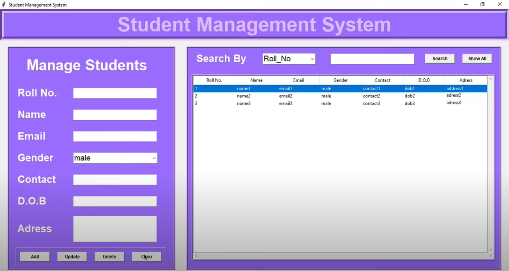
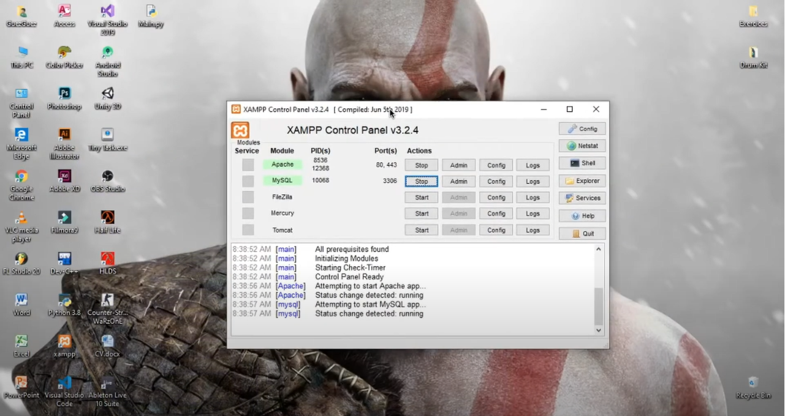
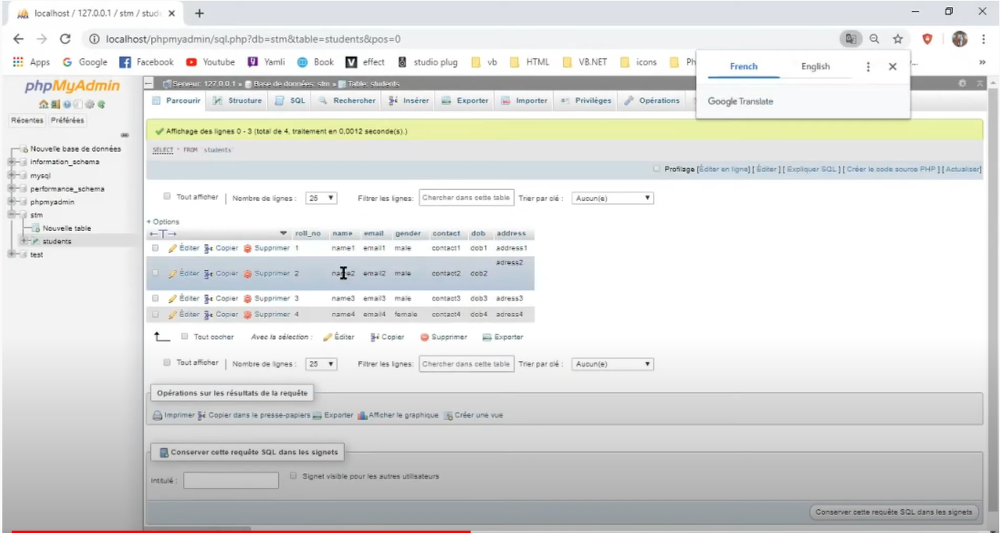

# Student-Management-System-Python

Youtube / https://www.youtube.com/watch?v=KWlOq7DlPus

Student Management System with Database | Python | X_Layer

Student database Management System in which admin can add a  new student,update the student details and delete the student from the record.

 

 

 

